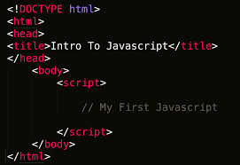

# Front-End Web Development
Course Code: HTTP 5122

Academic Year: 2025-2026

This course delivers the fundamentals of computer programming and introduces the tools for creating interactive web pages using the JavaScript programming language.

# Links
https://javascript.info/

# Images

> **Note**: This course lays the groundwork for front-end development with JavaScript, a crucial skill for creating dynamic and interactive web applications.
